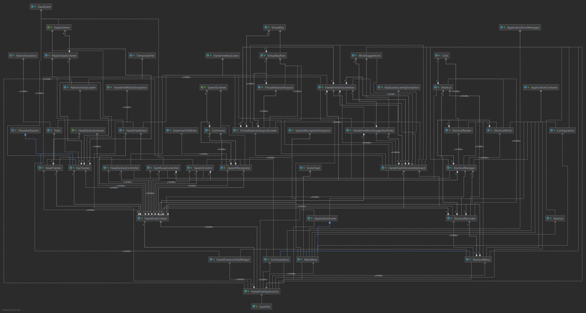
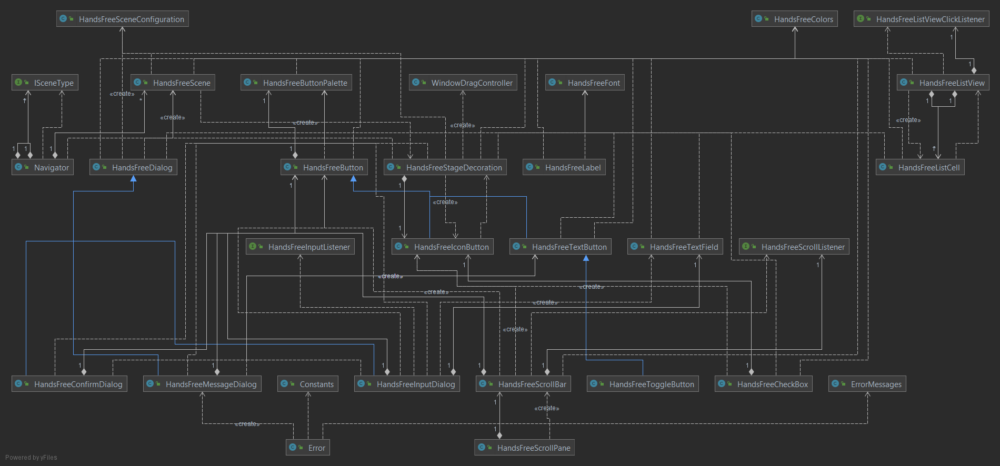
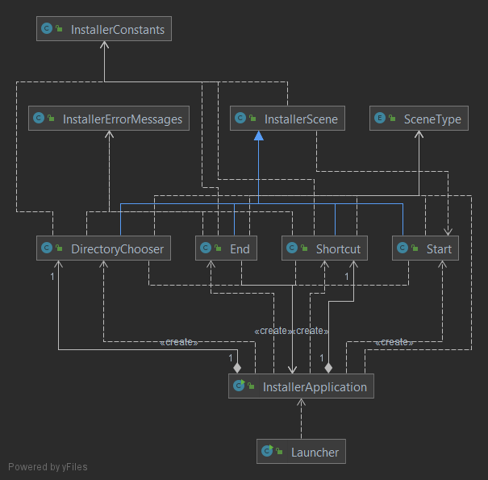

# Technische Dokumentation
* Entwicklungsumgebung
    * Setup
		* IntelliJ für Java-Projekte
		* Gradle als Build-Tool für Java
		
		* CLion für C++-Projekte
		* Visual Studio Build Tools 2019 als C++-Compiler, Assembler und Linker
		* CMake als Build-Tool für C++
	
		* Git für die Versionsverwaltung
	* Code Style
        * Keine Lücken zwischen Schlüsselwort und Klammer
            * if() statt
            * if ()
        * Öffnende geschweifte Klammern auf selbe Zeile
            * while(true) {  
              } statt
            * while (true)
              { }
        * Einrückung mit Leerzeichen statt mit Tabs
        * Für die Benennung verwenden wir überall camelCase ausser bei Klassen, bei welchen wir PascalCase verwenden
            * aVariable
            * AClass
        * Alle GUI-Komponente werden mit „HandsFree“ und dem Namen der Komponenten benannt
            * HandsFreeDialog statt nur
            * Dialog
* Architektur
	* Die Applikation läuft ausschliesslich auf Windows
    * Genereller Aufbau der Applikation
        * Man hat ein Haupt-Menu wo man folgende Einstellungen treffen kann
            * Eye Tracking an- und ausschalten
            * Speech Control an- und ausschalten
            * On-Screen Keyboard an- und ausschalten
            * Autorun an- und ausschalten
            * Zum Shortcut Menu wechseln
        * Zudem gibt es ein Shortcut-Menu wo man folgendes tun kann
            * Shortcut-Aufnahme starten
            * Shortcut-Aufnahme beenden
            * Shortcut löschen
            * Shortcuts ansehen
            * Shortcuts starten
        * Man wird den Computer mithilfe von Eye Tracking steuern können
            * Blinzeln mit beiden Augen löst einen Linksklick aus
            * Blinzeln mit dem rechten Auge löst einen Rechtsklick aus
        * Man wird mithilfe von Head Tracking bei Dialogen Ja- sowie Nein sagen können
            * Wenn man nickt, wird ja (Weiter, …) angeklickt und beim Schütteln des Kopfes nein (Abbrechen, …)
        * Man wird den Computer mithilfe von Sprachsteuerung steuern können
            * Man wird die obengenannten Shortcuts mithilfe von Sprachbefehlen starten können
            * Man wird einzelne Sprachbefehle ausführen können
        * Man wird ein On-Screen Keyboard zur Verfügung haben
            * Man kann die Tasten ansehen und so schreiben
            * Linksklicks auf spezielle Tasten behalten sie für den nächsten Klick gedrückt
            * Rechtsklicks behalten sie bis zum nächsten Linksklick darauf gedrückt
        * Man wird die Applikation automatisch beim Start von Windows starten können
    * Klassen
        * [Klassen](../classes/classes.md)
        * 
        * 
        * 
        * 
* Design
    * 
        * Das erste Fenster ist das Haupt-Menu
        * Das Zweite das Shortcut-Menu
        * Das Dritte ein Warnungs-Fenster
        * Das Vierte ein Informations-Fenster
* Verwendete APIs / Quellenangaben
    * JavaFX:
        * Link: <https://openjfx.io/>
        * JavaFX ist ein GUI-Framework mit dem man GUI Elemente zu seiner Applikation hinzufügen kann
    * Tobii Stream Engine SDK
        * Link: <https://developer.tobii.com/product-integration/stream-engine/>
        * Die Tobii Stream Engine SDK ermöglicht es, Daten vom Eye Tracker zu bekommen
    * Tobii Stream Engine for Java
        * Link: <https://github.com/GazePlay/TobiiStreamEngineForJava>
        * Die Tobii Stream Engine for Java ermöglicht es, den Blickpunkt im Java zu erhalten
        * Wir haben viele Modifikationen am Source Code vorgenommen, um beispielsweise auch geschlossene Augen erkennen
          zu können
    * Sphinx4
        * Link: <https://cmusphinx.github.io/wiki/tutorialsphinx4/>
        * Sphinx4 ermöglicht die Spracherkennung mithilfe eines grammar files, welches die gewünschten Befehle enthält
    * JNativeHook
        * Link: <https://github.com/kwhat/jnativehook>
        * Mit JNativeHook werden Mausklicks registriert, damit Shortcuts aufgenommen werden können
    * Wörterliste
        * Link: <https://github.com/first20hours/google-10000-english/blob/master/google-10000-english.txt>
        * words.txt enthält die 10000 am meisten benutzten englischen Wörter, sortiert nach Häufigkeit
    * TestFX
        * Link: <https://github.com/TestFX/TestFX>
        * TestFx ermöglicht das Testen von GUI-Elementen
    * JUnit
        * Link: <https://junit.org/junit5/>
        * JUnit ermöglicht das Testen von (Nicht GUI-)Code-Teilen
    * Gradle-Launch4J
        * Link: <https://github.com/TheBoegl/gradle-launch4j>
        * Erstellt ein .exe, welches die nötigen Berechtigungen verlangt, um auf bestimmte Pfade zugreifen zu können
    * MSLinks
        * Link: <https://github.com/vatbub/mslinks>
        * Erstellt ein Shortcut von einem Jar